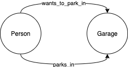
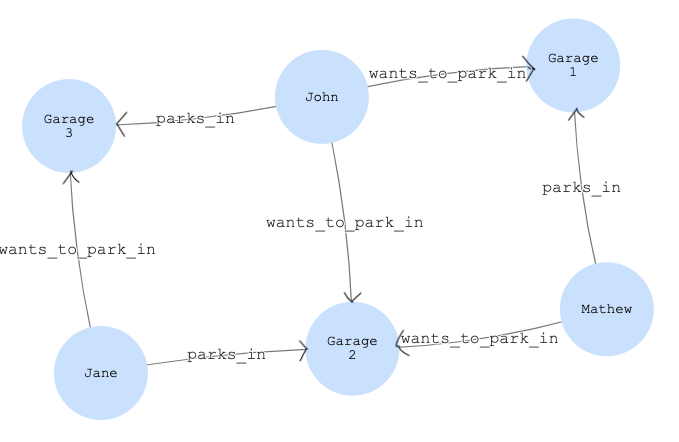

# Learning Graph - Three Way Trades

This project documents my early exploration into learning Graph database design and querying via Gremlin. I will walk through a real-world problem I want to solve and how I arrived at the answer. 

## Disclaimer

I am a beginner, so no doubt there may be easier ways to solve this with gremlin. I would love your feedback in the form of opening an issue or PR on this repo!

## Learning Tools

While I'm sure they will get easier to understand, I struggled with some of the existing online guides, including the official [Tinkerpop / Gremlin docs](https://tinkerpop.apache.org/docs/current/reference/) when trying to write my first queries. 

I stumbled upon the book below and found it incredibly helpful. Sharing in case it helps you on your graph journey, too:

* https://www.amazon.com/Practitioners-Guide-Graph-Data/dp/1492044075/


## Use Case

I'll walk you through a real-world problem I want to solve. I presently work for a large tech company in Seattle that has many office buildings. Parking spots are available for certain buildings, but you must join a waitlist and it can take anywhere from weeks to months to finally get a spot. 

Now, once you get a spot, the next challenge is that it is not uncommon for teams to change building locations as our company grows. So, after that long wait for your perfect parking spot, you might find that you have relocated to a new building a mile away and your perfect spot is no longer so perfect.

Today, this issue is solved by an email distribution list where folks can advertise what parking spot they have and what spot they would be willing to trade for. 

While it works, I'm left thinking, there must be a better way! It would be fairly easy to build a web app where users can enter this information and get automatically notified when valid swap opportunities appear. The only challenge is figuring out what database type, data model, and queries we need to identify our trade opportunities. 

This project will walk you through my reasoning of relational vs. graph, why I chose a graph, and how I solved for it. 

## Relational solution

Now, two-way swaps are pretty easy to solve in a relational database. Imagine your tables looks like this: 

### Garage table

**garage** table represents available parking locations and related metadata:

```
+----------------+---------------+--------------------+
| garage_id (PK) |    address    | is_covered_parking |
+----------------+---------------+--------------------+
|              1 | 123 Main st   | true               |
|              2 | 456 SW Union  | false              |
|              3 | 789 Greenlake | false              |
+----------------+---------------+--------------------+
```

### Users table

**user** table is your "customer" primary table. Each customer has one, and only one, `current_garage_id` where they currently park: 

```
+-------------+--------+------------------------+
| user_id(PK) |  name  | current_garage_id (FK) |
+-------------+--------+------------------------+
|           1 | Mathew |                      1 |
|           2 | Jane   |                      1 |
+-------------+--------+------------------------+
```

### Trade table

**trade** contains a one-to-many relationship of which garage(s) a given user would be willing to trade for:

```
+-----------+-----------------------------+
|  user_id (FK)  | desired_garage_id (FK) |
+----------------+------------------------+
| 1              | Garage_2               |
| 2              | Garage_1               |
| 2              | Garage_3               |
+----------------+------------------------+
```

Above, we can see that User 1 (Mathew) has Garage 1 and would be willing to trade for Garage 2. We also see that user 2 (Jane) has Garage 2 and would be willing to trade for either Garage 1 or 2. 

Let's write some SQL to find these swap opportunities!

First, let's start just by seeing what everyone has and what they want: 

```sql
SELECT 
    users.name as "Person_1",
    users.current_garage_id as "Person_1_current_garage",
    trades.desired as "Person_1_desired_garage"
FROM
    users LEFT JOIN trades on users.user_id = trades.user_id
```

Now, we have to do some additional joins (back to the same tables) to find two-way matches: 

```sql
SELECT 
    users1.name as "Person_1",
    users1.current_garage_id as "Person_1_current",
    trades1.desired_garage_id as "Person_1_desired",
    users2.name as "Person_2",
    users2.current_garage_id as "Person_2_current",
    trades2.desired_garage_id as "Person_2_desired"
FROM
    users as users1 
    LEFT JOIN trades as trades1 
        ON users1.user_id = trades1.user_id                       -- Find what person 1 wants
    LEFT JOIN trades as trades2 
        ON users1.current_garage_id = trades2.desired_garage_id   -- Find people that want person 1's garage
    LEFT JOIN users as users2 
        ON trades2.user_id = users2.user_id                       -- we need this join to find the current garage_id of user 2
WHERE
    users2.current_garage_id = trades1.desired_garage_id          -- finally, make sure that person 2 has a garage that person 1 wants
```

Now, the above isn't terrible... but the complexity grows significantly as you increase from two-way to 3+ way joins. 

There must be a better way!

## Graph solution

If you go back to our problem, we are concerned with the relationships between entities, namely people and garages that they have or want to trade for. This starts to sound like a graph problem!

### Graph Schema

Before we get into Gremlin details, let's visually model our graph data: 



Pretty simple, right? In graph terminology, Person and Garage are **vertices** and the relationships between them are **edges**. The arrow shows the direction of the edges, and you can "read" this schema like:

* `Person` **parks_in** `Garage`
* `Person` **wants_to_park_in** `Garage`

### Add graph data

Let's add some data to our graph:

```
g.addV('person').property(id, 'p1').property('name', 'Mathew').next()
g.addV('person').property(id, 'p2').property('name', 'Jane').next()
g.addV('person').property(id, 'p3').property('name', 'John').next()

g.addV('garage').property(id, 'g1').property('name', 'Garage 1').next()
g.addV('garage').property(id, 'g2').property('name', 'Garage 2').next()
g.addV('garage').property(id, 'g3').property('name', 'Garage 3').next()

g.V('p1').addE('parks_in').property(id, 'h1').to(g.V('g1')).next()
g.V('p2').addE('parks_in').property(id, 'h2').to(g.V('g2')).next()
g.V('p3').addE('parks_in').property(id, 'h3').to(g.V('g3')).next()

g.V('p1').addE('wants_to_park_in').property(id, 'w1').to(g.V('g2')).next()
g.V('p2').addE('wants_to_park_in').property(id, 'w2').to(g.V('g3')).next()
g.V('p3').addE('wants_to_park_in').property(id, 'w3').to(g.V('g1')).next()
g.V('p3').addE('wants_to_park_in').property(id, 'w4').to(g.V('g2'))
```

Our graph looks like this: 



## Modeling a two-way trade

Let's think about how we would identify a two-way trade opportunity: 

1. Start with a person, P1
2. Move to a garage, G1, that P1 `parks_in`
3. Move to a person, P2, that `wants_to_park_in` G1
4. Move to the garage, G2, that the P2 `parks_in`
5. Finally, check if the garage, G2, happens to be a garage that the original person, P1, `wants_to_park_in`. If so, you have found a two-way trade-opportunity. 

Let's use the image above as an example: 

1. Start with person (vertex) named Jane. 
2. Follow the `parks_in` edge to Garage 2.
3. Follow the `wants_to_park_in` edge to John.
4. Follow the `parks_in` edge to Garage 3.
5. Notice that Garage 3 has an incoming `wants_to_park_in` edge from our original person, Jane. We've found a two-way swap opportunity. 

As a bonus, can you look at this graph and understand why John and Mathew are **not** two-way swap opportunities? (*hint* - pay close attention to the edge labels).

## Graph query for a two-way trade

Let's convert our logic above to a gremlin query: 

```
g.V().hasLabel("person").has("name", "Jane")        // start with person Jane
.out("parks_in")                                    // Move to the garage Jane currently has
.in("wants_to_park_in")                             // Move to a person that wants Jane's garage
.out("parks_in")                                    // Move to the garage that the second person parks in
.in("wants_to_park_in")                             // Move to the final person
    .has("name", "Jane")                            // Only match if final person is same as first person (Jane)
.path()                                             // Show the path that we followed
.by(values("name"))                                 // Show the name property of each vertex we visited
```

Query results are: 

```
1	path[Jane, Garage 2, John, Garage 3, Jane]
```

If you look at the results, you can see that our traversal path traces the same circle ("cycle", in graph terms) that we outlined above. 

### Graph query for a three-way trade 

Now, if we wanted to instead look for three-way trade opportunities, we could add additional `in().out()` steps as needed. 

And while the gremlin query is still much simpler than the complex array of joins we had to do in our relational example, adding additional `in().out()` pairs is still repetitive. 

There must be a better way!

and, there is. We can implement `do...while` logic using gremlin's `repeat().until()` steps. 

Let's repeat our two-way swap query, but this time using a loop:

```
g.V().hasLabel("person").has("name", "Jane")
    .repeat(
        out("parks_in")             // Move out to a garage they want
        .in("wants_to_park_in")     // Move in to a person that wants that garage
        .simplePath()
    )
    .until(loops().is(eq(1)))       // Above, we've moved to a(the) person(s) that wants to park in Jane's garage
    .out("parks_in")                // From each of those people, we move out to the garage they park in
    .in("wants_to_park_in")         // Then we move to the people that want *that* garage
        .has("name", "Jane")        // and finally, we filter results to only include garages that our original person, Jane, also wants to park in
    .path()
        .by(values())
```

The above results in the same values as before: 

```
path[Jane, Garage 2, John, Garage 3, Jane]
```

Now, this query is more verbose than our first version. But the beauty is that we can easily move from doing a two-way trade to a three-way trade by changing our loop counter to the below:

```
.until(loops().is(eq(2)))
```

If we re-run our query, we now find a 3-way trade:

```
path[Jane, Garage 2, Mathew, Garage 1, John, Garage 3, Jane]
```

You might be wondering - Why do I have a repetitive `.out("parks_in").in("wants_to_park_in")` **after** the `repeat().until()` loop? Why not just remove this and instead increase my loop counter by 1? 

Well, the reason is that we have `.simplePath()` inside our `repeat()`. This makes sure that a loop only returns paths that do not traverse the same vertex more than once. For a small sample data set like this, its not a big deal... but in production, not forcing a simple path could have a big impact on processing time. 

So, instead, we add our final `.in().out()` pair **after** the loop is done. I wouldn't be surprised if there's a better way to do this... and if you know of one, please share!

## Improving our graph query

Update: I've learned some new tricks from chapter 8 & 9 in **The Practitioner's Guide to Graph Data**, and am now able to improve the first answer, above. Rather than replace my original solution above, I'll Show the new answer, below:

```
%%gremlin

1 g.V().hasLabel("person").has("name", "Jane").as("StartingPerson")
2     .repeat(
3         out("parks_in")                                 // Move out to a garage they want
4         .in("wants_to_park_in").as("CurrentPerson")     // Move in to a person that wants that garage
5     )
6     .until(
7         where("CurrentPerson", eq("StartingPerson"))    // Either we've found a match...
8         .or()                                           // or, we've gone as far as we're willing to go
9        .loops().is(eq(3))                              
10    )
11    .where(eq("StartingPerson"))                        // Make sure we completed a cycle back to starting person
12    .limit(5)
13    .project("path", "Number of trades")                // Shape our output
14        .by(path().by(values()))                        // Show the people and garages in the trade
15        .by(
16            path().count(local).math('(_ - 1) / 2')
17       )
```

Results: 

```
1	{'path': path[Jane, Garage 2, John, Garage 3, Jane], 'Number of people in the trade': 2.0}
2	{'path': path[Jane, Garage 2, Mathew, Garage 1, John, Garage 3, Jane], 'Number of people in the trade': 3.0}
```

Lines 1 through 5 are almost the same as before. We move `out()` from our starting person, Jane, to the garage she wants, then we move `in()` to person(s) that have that garage. The biggest difference is that I removed `simplePath()` because I **do** want to find cycles that start and end on the same person. The reason I thought I had to use it is that I thought leaving it out might lead to infinite loops... but I realized that `.loops().is(eq(3))` on line 9 should prevent that. Of course, on this small sample data set, that wouldn't be a problem - but I want to think within the context of production. 

The next change is that line 7, `where("CurrentPerson", eq("StartingPerson"))` will end our loop if our current person in the loop is the same as our starting person, meaning we've found a trade opportunity. This line makes use of the `StartingPerson` and `CurrentPerson` labels we defined with `as()` on 1 and 4.

Notice the use of `or()` on line 8. Here, I'm saying that a traversal is finished at the earlier of finding a trade opportunity *or* having completed three loops. This is done because (a), our starting person might not have any trade opportunities and (b) in a large, production data set, I only want to look for shorter-distance (nearby neighborhoods) trade opportunities. 

On line 9, the `3` in `.loops().is(eq(3))` means that, at most, I want to find 2 and 3-way trade opportunities. If I wanted to search for everything up to 4-way trades, I could simply increase this value to 4. 

Because our loop could end simply because 3 loops have been created rather than the fact that we've actually found a trade opportunity, the `where()` step on line 11 makes sure that any such paths are filtered out of our result set. 

The `limit(5)` on Line 12 just means return the first five paths that we find. 

Lines 13 through 16 are just used to format our output. 
